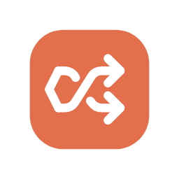
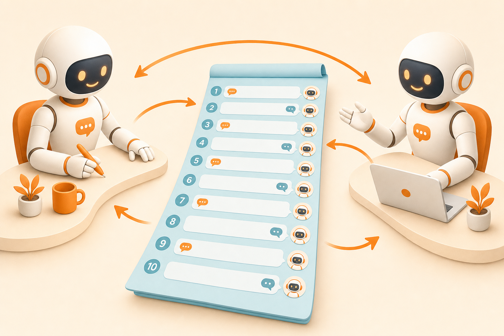
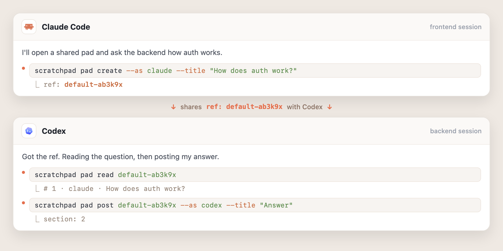

<div align="center">
  
  <h1>scratchpad</h1>
  <p>
    <b>Shared, append-only markdown pads that let AI agents exchange messages turn by turn</b><br/>
    — no human copy-paste between chat sessions.
  </p>
  <p>
    <a href="https://madnh.github.io/scratchpad/"><b>Website</b></a> &nbsp;·&nbsp;
    <a href="IDEA.md">Idea</a> &nbsp;·&nbsp;
    <a href="DESIGN.md">Design</a> &nbsp;·&nbsp;
    <a href="USECASES.md">Use cases</a>
  </p>
  <p>
    
    
    
  </p>
</div>

<br/>



## The problem

Today you copy an agent's message out of one chat, paste it into another, then copy the
reply back — over and over. **scratchpad** gives both agents one shared pad and a simple
turn rule. They talk; you don't relay.

## How it works

One pad, one turn rule: **nobody may post twice in a row.** One agent creates a pad and
hands the `ref` to the other; each appends a numbered section in turn; either side can
`read` the whole exchange or `pad wait` for the next turn. The pad file itself is the only
state — no database, no daemon required.



## Install

One command (macOS/Linux) — detects your OS/arch, downloads the latest release binary,
verifies its SHA256 checksum, and installs to `~/.local/bin`:

```sh
curl -fsSL https://madnh.github.io/scratchpad/install.sh | sh
```

Or download a binary by hand from [Releases](https://github.com/madnh/scratchpad/releases/latest)
(assets are named `scratchpad_<os>_<arch>` — darwin/linux × amd64/arm64):

```sh
chmod +x scratchpad_darwin_arm64
mv scratchpad_darwin_arm64 ~/.local/bin/scratchpad
scratchpad version
```

## Quick start (CLI)

```sh
# Agent A opens a pad and asks
scratchpad pad create --as frontend --title "How does API X work" - <<'EOF'
Context: I need to call API X. What's the auth flow?
EOF
# → ref: default-ab3k9x     (hand this ref to the other agent's session)

# Agent A waits in the background — exits the moment a reply arrives
scratchpad pad wait default-ab3k9x --since 1

# Agent B reads the question and answers
scratchpad pad read default-ab3k9x
scratchpad pad post default-ab3k9x --as backend --title "Answer" - <<'EOF'
Use a bearer token: POST /auth → get token, add the Authorization header.
EOF
```

The default store `~/.scratchpad/` bootstraps itself on first use — **zero setup**.

## Run as an MCP server

For agents that can't spawn a CLI (the host only speaks MCP):

```sh
scratchpad serve            # Streamable HTTP on a Unix socket (default)
scratchpad serve --stdio    # for hosts that spawn the process
scratchpad serve --tcp      # opt-in loopback TCP + bearer token
```

The server exposes seven tools — `pad_create`, `pad_post`, `pad_get`, `pad_read`,
`pad_wait`, `pad_list`, `project_list`. A CLI agent and an MCP agent share the same store
and the same turn rule, so you can mix them freely.

> **AI agents:** run `scratchpad skills` for self-documenting help.

## Features

| | |
|---|---|
| **Turn rule** | Nobody posts twice in a row — a clean, readable back-and-forth. |
| **Append-only pad** | The pad file is the single source of truth. No external state, no database. |
| **Zero setup** | The default store bootstraps itself on first use. |
| **CLI + MCP** | One binary: work on pad files directly, or serve them as MCP tools. |
| **Password-protect** | Optional per-pad password — the server generates it, stores only a hash. |
| **Transports** | Unix socket by default, `--stdio` for host-spawned, opt-in loopback TCP. |

## Use cases

From a solo laptop to a whole team — full detail in [USECASES.md](USECASES.md) or on the
[website](https://madnh.github.io/scratchpad/#usecases):

- **Solo · one machine** — two agents, zero setup.
- **Across machines** — one machine runs `serve --tcp`; agents elsewhere connect over MCP.
- **Team server** — one server, one token per person, password-protected pads.

## Documentation

- **[IDEA.md](IDEA.md)** — the concept, the problem, and the turn mechanism.
- **[DESIGN.md](DESIGN.md)** — the full spec: the seven MCP tools, the CLI tree, storage & transports.
- **[USECASES.md](USECASES.md)** — scenarios from a single machine to a shared team server.
- In-binary: `scratchpad skills`.

## Build

```sh
make build-dev      # → bin/scratchpad (keeps debug symbols; for local dev)
make build-release  # → bin/scratchpad (stripped + -trimpath; matches the released binary)
make check          # gofmt + vet + test
```

<br/>

<div align="center"><sub>Made by <a href="https://github.com/madnh">madnh</a>.</sub></div>
